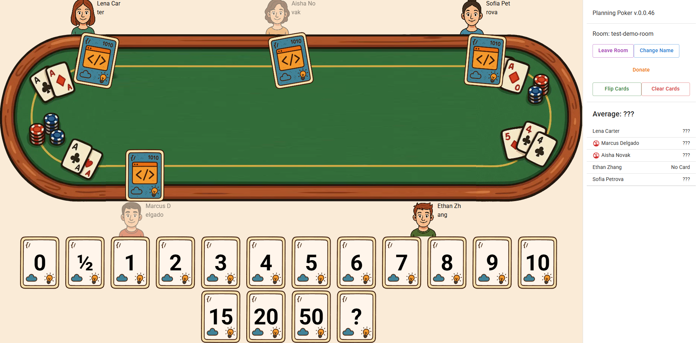

# poker-planning-2

https://poker-planning.stswoon.ru/

* How to create vite - https://vite.dev/guide/#scaffolding-your-first-vite-project
* How to create node.js+express+typescript - https://blog.logrocket.com/express-typescript-node/
* How to create vite lib - https://onderonur.github.io/blog/creating-a-typescript-library-with-vite/
* NPM workspaces - https://medium.com/@90mandalchandan/mastering-npm-workspaces-a-comprehensive-guide-for-beginners-bc239c3c6223
  * https://habr.com/ru/articles/540114/

//TODO: js chank warning

Помогалка для генерации картинок:
- сгенерируй картинку стола для покера вид сверху, эта картинка должна быть в мультяшном стиле, она будет использоваться в онлайн html игре, поэтому должна быть рисованной
- сгенерируй картинку лица человека вид спереди, эта картинка должна быть в мультяшном стиле, она будет использоваться в онлайн html игре, поэтому должна быть рисованной
- сгенерируй еще 5 лиц

//TODO: TC - go between rooms and wait - it cause Broadcast room red-booby8 to usersId: [] - so no state got to FE - so FE not shows user 
